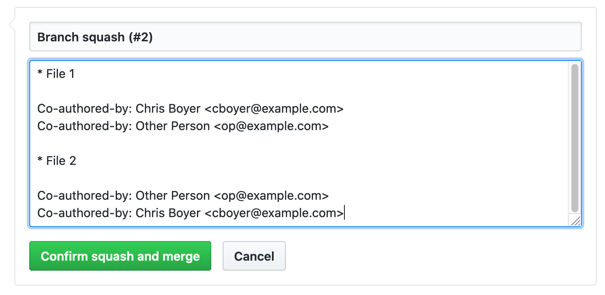

# Frequently Asked Questions

### I'm getting an error that says "ModuleNotFoundError: No module named 'guet'"
Usually this means when you installed guet, you used `pip install guet` instead of `pip3 install guet`. This means that guet is only installed to work with python2. However, python3 is required for guet to work. Running `pip uninstall guet` and then `pip3 install guet` should fix the problem.

### How do I use guet with [husky](https://github.com/typicode/husky)?

To use guet with husky, you will need to start guet tracking alongside any present git hooks. To accomplish this, use the commmand `guet start -a`. guet uses the pre-commit, post-commit, and commit-msg hooks, so you'll need to update them in husky to look something like this:
```json
  "husky": {
    "hooks": {
      "pre-commit": "yarn test && .git/hooks/pre-commit-guet",
      "commit-msg": "yarn test && .git/hooks/commit-msg-guet",
      "post-commit": "yarn test && .git/hooks/post-commit-guet"
    }
  }
```

If package.json is not in the root of the repository you'll have to change to the root directory before each guet hook:
```json
  "pre-commit": "yarn test && cd .. && .git/hooks/pre-commit-guet"
```
This will not work: `"post-commit": "../.git/hooks/pre-commit-guet"`

### I want to squash my commit, but still save co-authors. What do I do?

As long as your your `Co-authored-by Name <emai>` lines are in the squashed commit, they will show up. In this example, you can remove all the duplicated lines under the "File 2" commit.



### What do I need to do to uninstall guet?

`pip3 uninstall guet` is the command you need to run to remove guet. In repositories you've initialized for guet tracking, you can run `guet yeet` to remove its configurations. If you're sure you'll never want to use guet again, `guet yeet --global` will remove its global configurations.


### How do I upgrade my version of guet?

The version of guet installed can be upgraded using the following command:

```
pip3 install guet --upgrade
```

To see the version releases, changes between them, and upgrade guides, check the [change log](./.github/CHANGELOG.md)

### How do I install a specific version of guet?

Installing a specific version of guet can be done with the following comming:

```
pip3 install guet==2.4.6
```
